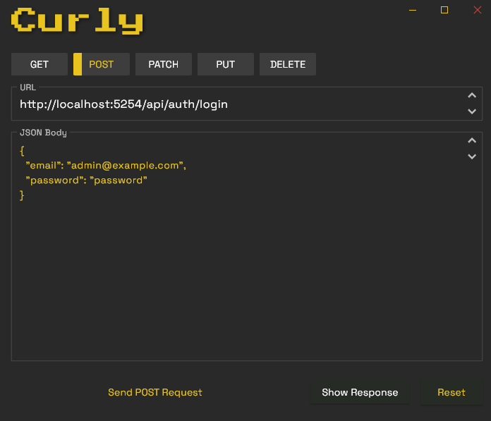
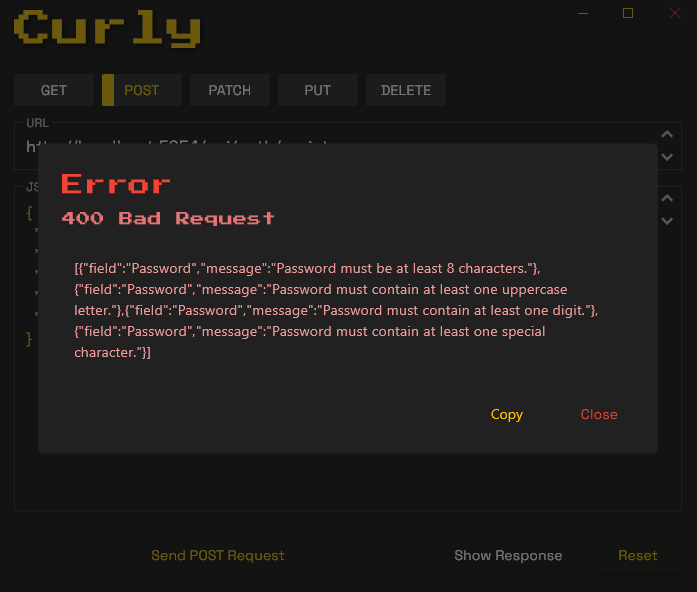

# Curly

A simple HTTP client desktop app built with Flutter for quickly testing REST APIs. Send GET, POST, PUT, PATCH, and DELETE requests.
 

## Download

You can download the latest release 
[HERE](https://github.com/jockebjers/curly/releases/download/curly/release.zip)!

 
 

  

## Features

- **Multiple HTTP Methods**: Support for GET, POST, PUT, PATCH, and DELETE requests
- **Smart query parameters**: Automatically converts JSON body to query parameters for GET requests
- **Error handling**: Clear error messages and status code reporting
- **Persist data**: The last five url and json-inputs are saved for convenience 

## How to Use

1. **Select HTTP method**: Choose from GET, POST, PUT, PATCH, or DELETE
2. **Enter URL**: Add your API endpoint URL
3. **Add JSON Body**: For GET requests, JSON will be converted to query parameters
4. **Send request**: Click the send button to execute your request
5. **View response**: See response with status code
6. **Use arrows**: Go back to your latest requests
 
 
 

<h2 align="center">200 Response</h2>

  

<h2 align="center">400 Response</h2>

  

